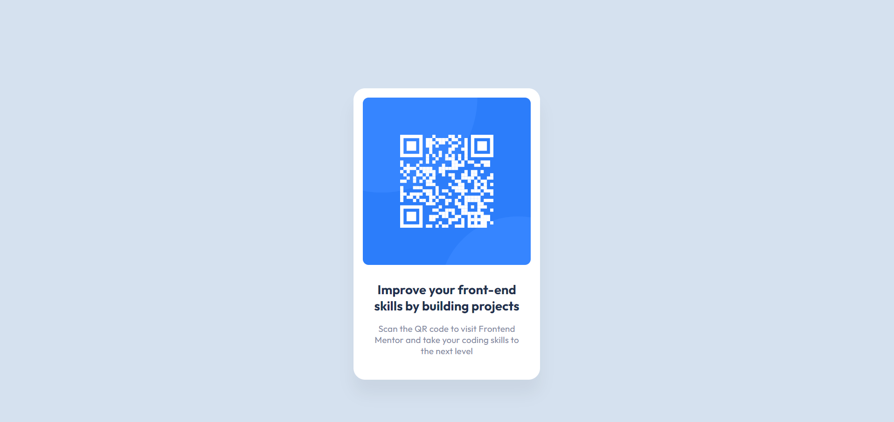

# Frontend Mentor - QR code component solution

This is a solution to the [QR code component challenge on Frontend Mentor](https://www.frontendmentor.io/challenges/qr-code-component-iux_sIO_H). Frontend Mentor challenges help you improve your coding skills by building realistic projects.

## Table of contents

- [Overview](#overview)
  - [Screenshot](#screenshot)
  - [Links](#links)
- [My process](#my-process)
  - [Built with](#built-with)
  - [Useful resources](#useful-resources)
- [Author](#author)

## Overview

### Screenshot

### Links

- Solution URL: [QR code component using HTML and CSS.](https://www.frontendmentor.io/solutions/qr-code-component-using-html-and-css-rpWBWZQsrZ)
- Live Site URL: [Frontend Mentor | QR code component](https://qr-code-component-link.netlify.app/)

## My process

### Built with

- Semantic HTML5 markup
- CSS custom properties
- Mobile-first workflow

### Useful resources

- [Learn HTML](https://www.w3schools.com/html/) - HTML, which stands for Hypertext Markup Language, is the standard language used to create and design web pages. It provides a structured way to organize content on the internet, allowing developers to define the structure and layout of a web page using a set of predefined tags and attributes.

- [Learn CSS](https://www.w3schools.com/css/) - CSS, or Cascading Style Sheets, is a stylesheet language used to describe the presentation and styling of HTML (and XML) documents. It enables developers to control the layout, appearance, and design of web pages, ensuring consistency and aesthetic appeal across different devices and screen sizes.

- [Learn CSS Responsive](https://www.w3schools.com/css/css_rwd_intro.asp) - CSS responsive design refers to the practice of creating web pages that dynamically adjust and adapt their layout and appearance based on the characteristics of the device and screen size being used to view them. Responsive design ensures that websites look good and are functional across various devices, including desktops, laptops, tablets, and smartphones.

## Author

- Frontend Mentor - [@ZUHRIDDIN-SHARIPOV](https://www.frontendmentor.io/profile/ZUHRIDDIN-SHARIPOV)
- GitHub - [@ZUHRIDDIN-SHARIPOV](https://github.com/ZUHRIDDIN-SHARIPOV)
- Telegram - [@zuhriddinshx](https://t.me/zuhriddinshx)
